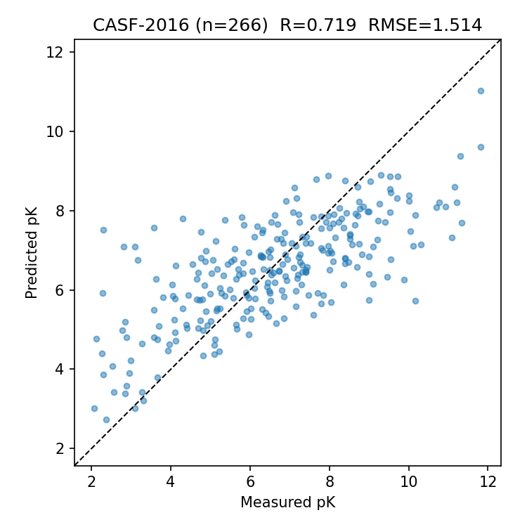
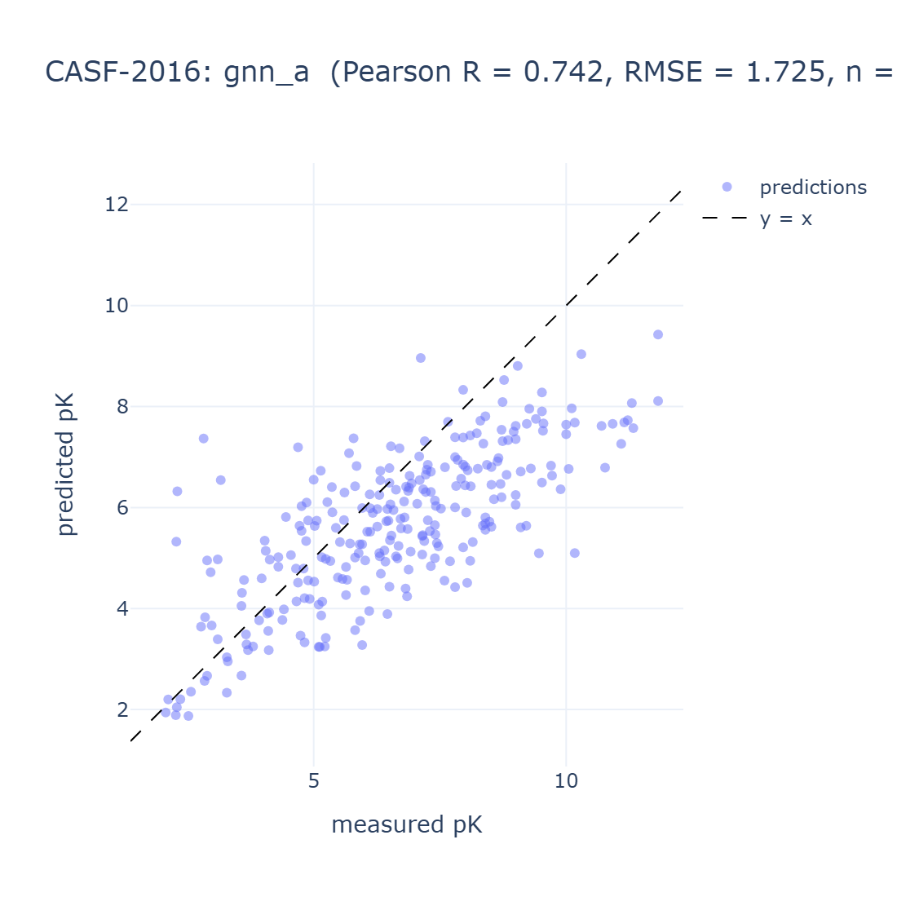

# Protein-Ligand Binding Affinity Predictor

Predicts binding affinity (pKd/pKi/pIC50) of a small molecule against a protein target, trained on PDBbind v2020 and evaluated on the CASF-2016 core set.

The GNN model (GIN ligand encoder + frozen ESM-2 pocket embeddings) reaches **Pearson R = 0.74** on CASF-2016, improving correlation over a strong ECFP4 + XGBoost baseline.

## Results

CASF-2016 core set (n = 266, intersected with v2020 refined). CASF IDs are strictly excluded from train/val.

| Model                                | Pearson R | Spearman R | RMSE  | MAE   |
| ------------------------------------ | --------- | ---------- | ----- | ----- |
| ECFP + ESM-2 35M pool + XGBoost      | 0.719     | 0.687      | **1.514** | **1.184** |
| Ligand-GIN + ESM-2 35M pool + MLP    | **0.740** | **0.714**  | 1.582 | 1.248 |
| Pafnucy (Stepniewska-Dziubinska)*    | 0.78      | -          | 1.42  | -     |
| DeepDTA (Ozturk et al. 2018)*        | 0.66      | -          | 1.59  | -     |

\* Literature numbers on the full 285-complex core set, not directly comparable.




## Quickstart

```powershell
git clone https://github.com/Feargal/protein-ligand-binding.git
cd protein-ligand-binding
python -m venv .venv
.\.venv\Scripts\Activate.ps1

pip install -e ".[dev]"
pytest

# With the ML stack (torch, rdkit, esm, etc.)
pip install -e ".[ml,dev]"

# After downloading PDBbind + CASF-2016 (see scripts/download_pdbbind.py)
plb data prepare
```

## Data

PDBbind v2020 and CASF-2016 are free for academic use but require registration at <http://www.pdbbind-plus.org.cn/>. Not redistributed here. Place the archives in `data/raw/` and run `python scripts/download_pdbbind.py`.

## Layout

```
src/plb/
  data/      # PDBbind parsing, splits, ligand + ESM featurisation, PyG dataset
  models/    # GIN encoder + AffinityModel
  train.py   # training loop
  eval.py    # CASF-2016 metrics
  cli.py     # `plb` CLI
configs/     # YAML run configs
notebooks/   # EDA, featurisation checks, XGBoost baseline, GNN training
scripts/     # data download, ESM + ligand-graph precomputation
tests/       # pytest (65 tests)
reports/     # scatter plots
runs/        # training artefacts (config, log, best.pt, metrics)
```

## Roadmap

- [x] Data pipeline, splits, EDA
- [x] Ligand graphs (RDKit), pocket extraction (Biopython), ESM-2 embeddings
- [x] XGBoost baseline: R = 0.72, RMSE = 1.51 ([notebook](notebooks/03_baseline_xgboost.ipynb))
- [x] GNN model: R = 0.74, RMSE = 1.58 ([notebook](notebooks/04_gnn_training.ipynb))
- [ ] HF Hub model card + Streamlit demo
- [ ] Scaffold split, 3D pocket features, ensembling

## License

Code: MIT. PDBbind data: see their own license.
